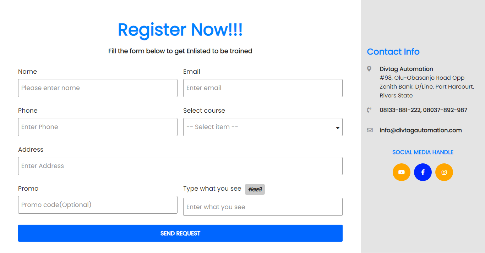

# Registration Form

This project simulates a registration form for appyling for a training at a large training institute.

Forms are important compontent of the web as they tend to allow imformation to be passed in by client/user to various places on the web.
They are used vastly for different purposes. In this project i tried to experiment with the knowledge i had about working with forms by
building this complete registration form.

- [Overview](#overview)
  - [Screenshot](#screenshot)
  - [Links](#links)
- [My process](#my-process)
  - [Built with](#built-with)
  - [What I learned](#what-i-learned)

## Overview

### Screenshot

### Links

- Solution URL: https://github.com/nuel1/Registration-form
- Live Site URL: https://optimistic-aryabhata-1ab2a5.netlify.app

## My process

### Built with

- Semantic HTML5 markup
- CSS custom properties
- Flexbox
- CSS Grid
- Mobile-first workflow
- Vanilla Javascript

### What I learned

I pretty much learnt quite alot in this project. Here is an outline of things i learnt throught building this project:

- Regular Expression( purposefully for validating user information ).
- CSS Grid.
- Browser Local Storage.
- Ajax ( For sending user data off to an external database ).

I used the Javascript Regular Expression to test and validate user input, so as to avoid incorrect input that could harm or crash
the rest of the program. By experimenting with regex through building this project, i indeed acquired a disirable amount of experience
working with Regular Expression.

Secondly, i learnt a great deal about CSS Grid. Each form input field are nicely in position with the help of CSS Grid.

In addition, I made use of the Browser Local Storage basically to store registered user data for future reference.

Lastly, I learnt how to use Ajax by sending the valid information by the user to an external database( non-existing database ).
